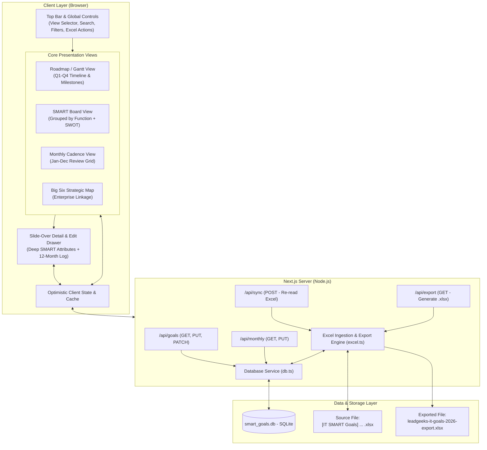
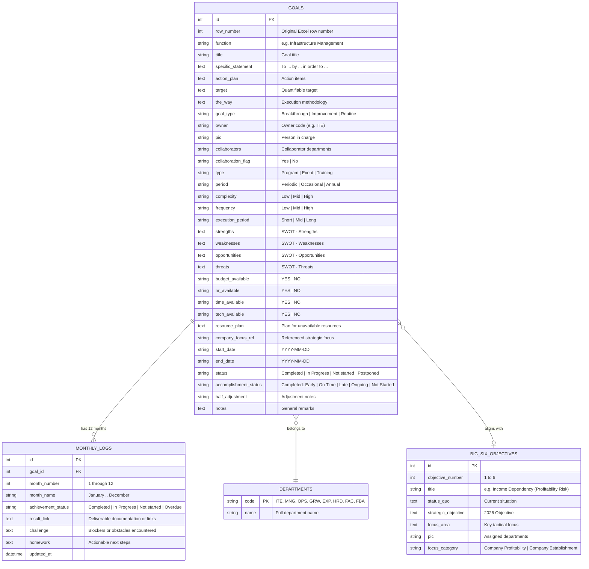

# System Architecture Specification
## LeadGeeks Inc. — IT SMART Goals 2026 Platform

- **Status**: Approved
- **Runtime**: Node.js v20+ (Current: Node v24.18)
- **Framework**: Next.js 14/15 (App Router, TypeScript)
- **Persistence Layer**: Embedded SQLite (`better-sqlite3`)
- **Styling & Components**: Tailwind CSS, Lucide React

---

## 1. High-Level Architecture Overview

The system is architected as a cohesive fullstack Next.js application following Unidirectional Data Flow (UDF) principles. It bridges raw tabular Excel data into a typed relational data model served via Next.js App Router API endpoints and reactive React client components.



---

## 2. Relational Database Schema (SQLite)

The database file is located at `/home/noah/project/smart/data/smart_goals.db`.



---

## 3. Server API Contracts

### 3.1 `GET /api/goals`
- **Response**: Array of all 19 IT Goals with summary metadata, date ranges, status tags, and SWOT summaries.
- **Query Params**:
  - `function`: Optional filter by department function.
  - `status`: Optional filter by execution status.
  - `goal_type`: Optional filter by Breakthrough / Improvement.
  - `search`: Full-text search across title, specific statement, and measurable indicators.

### 3.2 `GET /api/goals/[id]`
- **Response**: Detailed single goal record including all SMART attributes, SWOT quadrants, resource availability, and the full 12-month array of `monthly_logs`.

### 3.3 `PUT /api/goals/[id]`
- **Payload**: Partial or full update of goal properties (status, accomplishment_status, dates, SWOT, action plan).
- **Response**: Updated goal object with audit timestamp.

### 3.4 `GET /api/monthly?month=[1-12]`
- **Response**: Matrix of all 19 goals with their specific log for that selected month (achievement status, result link, challenges, homework).

### 3.5 `PUT /api/monthly/[id]`
- **Payload**: `{ achievement_status, result_link, challenge, homework }`
- **Response**: Updated monthly log record.

### 3.6 `POST /api/sync`
- **Behavior**: Re-reads the source Excel file `/home/noah/Documents/sheets/'[IT SMART Goals] - LeadGeeks Inc. 2026 Goals, Objectives and Plans.xlsx'`, compares with SQLite, and restores or updates records.

### 3.7 `GET /api/export`
- **Behavior**: Generates a standard Excel workbook (`.xlsx`) populated with the current live database state, preserving sheets and column alignments, delivered as a downloadable file attachment.

---

## 4. Frontend Component Hierarchy

```text
src/
├── app/
│   ├── layout.tsx                # Root layout with fonts, metadata, global styles
│   ├── page.tsx                  # Main application orchestrator
│   ├── api/
│   │   ├── goals/route.ts        # Goals list API
│   │   ├── goals/[id]/route.ts   # Single goal CRUD
│   │   ├── monthly/route.ts      # Monthly grid API
│   │   ├── monthly/[id]/route.ts # Single month update
│   │   ├── sync/route.ts         # Excel ingestion
│   │   └── export/route.ts       # Excel file generator
├── components/
│   ├── navigation/
│   │   ├── TopHeader.tsx         # Brand logo, global search, view switch tabs, Excel sync/export
│   │   └── FilterBar.tsx         # Function pills, status filters, goal type toggles
│   ├── views/
│   │   ├── RoadmapView.tsx       # Interactive Q1-Q4 Gantt timeline with month headers
│   │   ├── BoardView.tsx         # Function-grouped card grid with SMART chips
│   │   ├── CadenceView.tsx       # Monthly review grid (Jan-Dec) with result links & homework
│   │   └── StrategicMapView.tsx  # Linkage between The BIG Six and IT Goals
│   ├── drawer/
│   │   ├── GoalDrawer.tsx        # Slide-over panel container
│   │   ├── SmartDetailsTab.tsx   # Specific, Measurable, Attainable, Relevant, Timebound editor
│   │   ├── SwotTab.tsx           # 2x2 SWOT Matrix editor
│   │   └── MonthlyLogsTab.tsx    # 12-month tabbed editor with results, challenges, homework
│   └── ui/
│       ├── Badge.tsx             # Semantic status and priority badges
│       ├── Button.tsx            # 7-state button with loading & tactile states
│       ├── Input.tsx             # High-contrast accessible input field
│       └── Toast.tsx             # Notification feedback system
├── lib/
│   ├── db.ts                     # SQLite connection pool & query methods
│   ├── excel-parser.ts           # XLSX file parser & seed logic
│   ├── excel-exporter.ts         # XLSX workbook builder
│   └── types.ts                  # Shared TypeScript interfaces & models
└── styles/
    └── globals.css               # Design tokens, CSS custom properties, scrollbars
```

---

## 5. Security & Data Integrity Considerations

1. **Parameter Sanitization**: All database queries use parameterized SQL statements via `better-sqlite3` to eliminate SQL injection risks.
2. **Atomic Migrations & Seeding**: Database seeding runs within a single SQLite transaction (`db.transaction(...)`). If parsing fails, the transaction rolls back cleanly.
3. **Local File Integrity**: The source spreadsheet file is accessed in read-only mode during import; exports are generated to dedicated export buffers or safe paths to prevent file collision.
